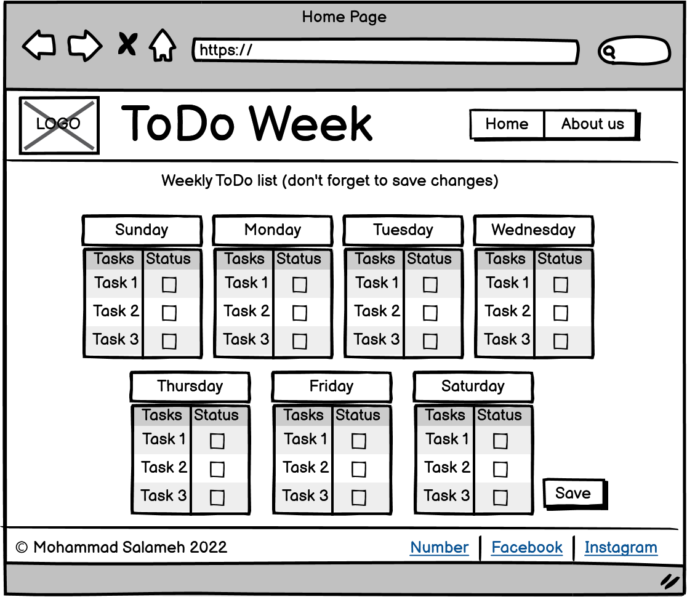
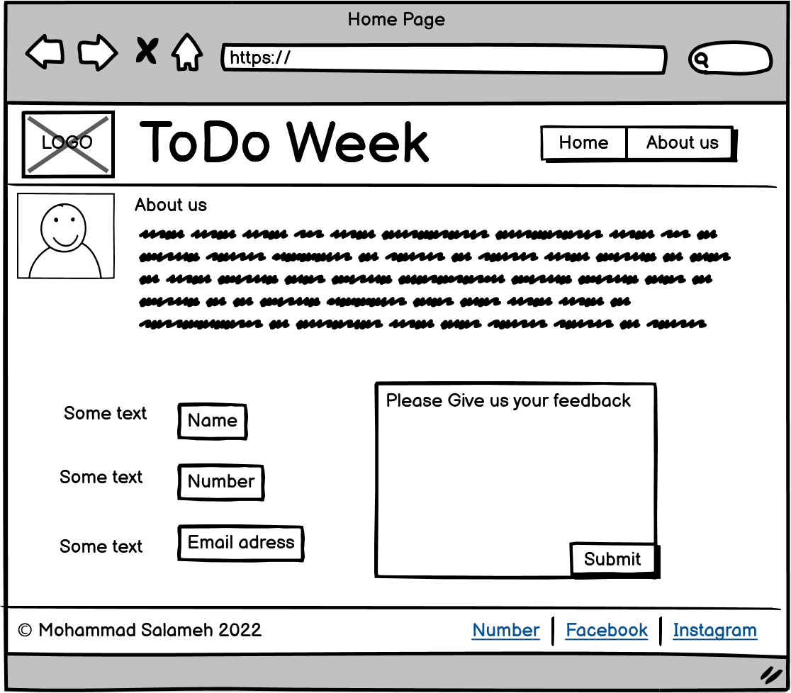

# todo-project
Website name is ToDoweek. Basically it's a weekly to do list.
below are the wireframe for both home page and about us page.

## todo-html

I learned that HTML is scripting language, we use it to communicate to the browser what we need to show to user on the webpage.

We learned about inline and block level elements, and about the box model.

We implemented some CSS to style our webpage.

the HTML it'self didn't take much time, but when we started to style our webpage as per the wireframe it did take a lot of time and effort implementing the simple CSS we learned in this lecture

## todo-style

Now everything is more clear on how to use CSS and how to position our elements as we see fit.
The webpage is getting closer to the initial wireframe that is shown below.

It takes sometime to get used to all types of methods that we can use to manipulate our webpage style as we see fit.

## todo-js

We can interact with the user now! 

A simple start, no loops required.
just alerts, prompts and some conditional statements.

Didn't take much time to do this task just as expected.

### Home page wireframe

### About us page wireframe

